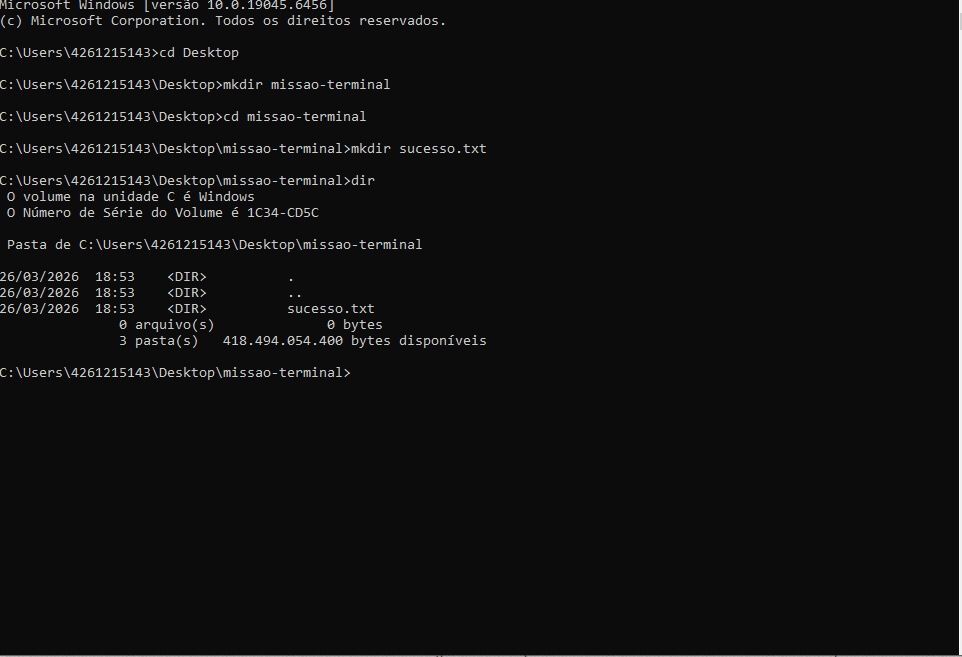

# ⚡ Meus Comandos Favoritos
Aqui estão os comandos que mais utilizei na aula de Terminal:

- `cd`: Para navegar entre pastas.
- `dir`: Para listar arquivos.
- `mkdir`: Para criar pastas
- `del`: Para apagar arquivos
- `cls`: Para limpar toda bagunça da tela

## 📸 Evidência de Execução

